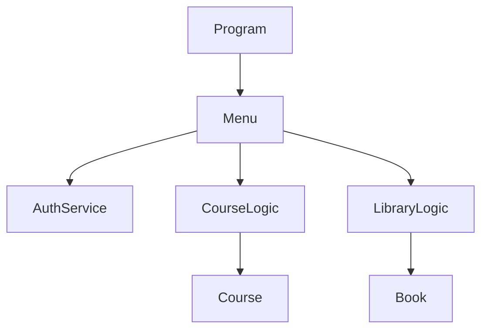
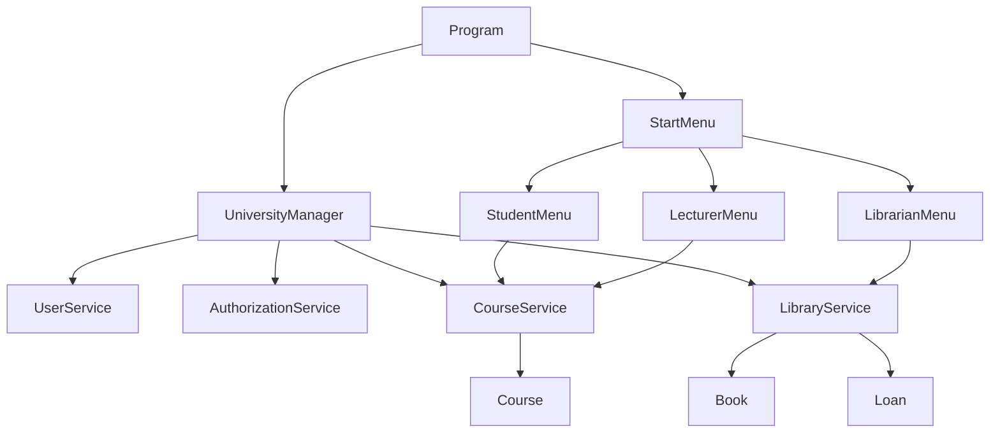
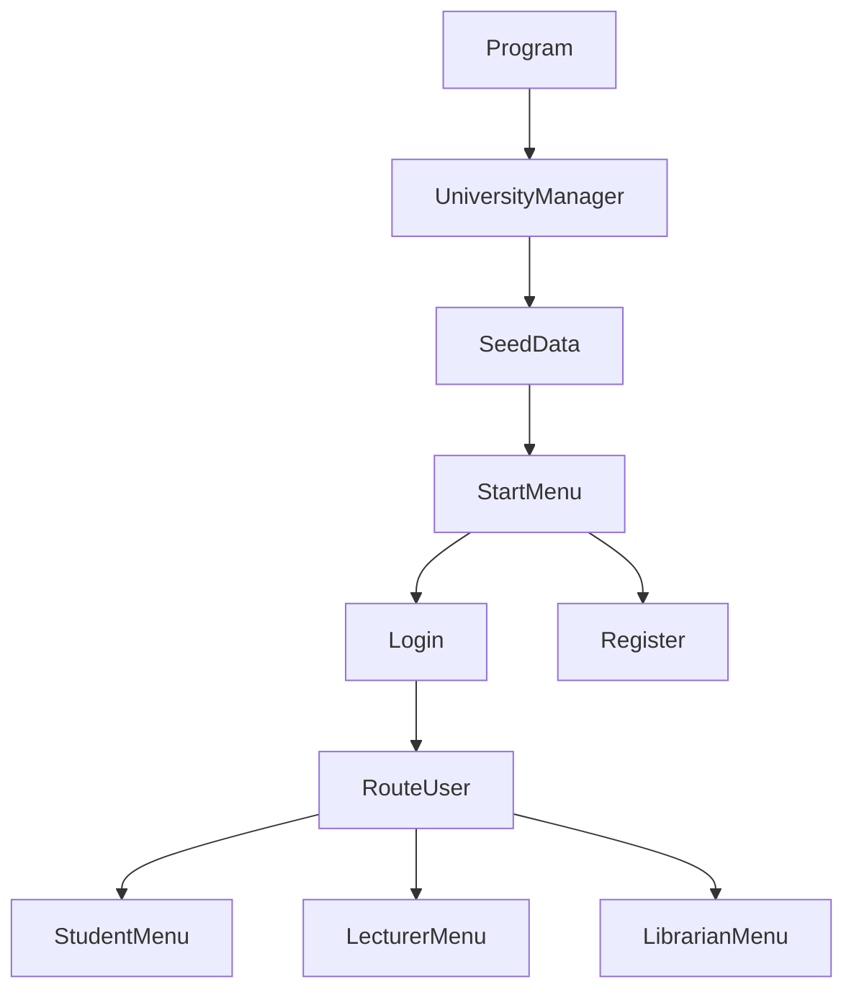
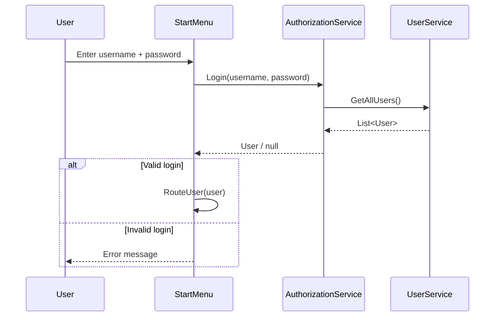
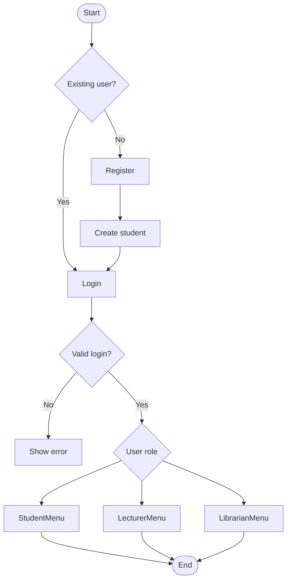

# Uni-system

A simple university administration system built in C# as a learning project.  
The application simulates core university operations such as student enrollment, course management, authentication, and library book loans through a console-based interface.

Developed for course assignment **IS-110** (Winter/Spring 2026).

---

## Project Purpose

This project was created to practice object-oriented programming in C# and understand how different parts of a software system can be organized into separate responsibilities.

The system models:

- Students and exchange students
- Lecturers and librarians
- Courses and enrollment
- Books and loans
- Authentication and role-based access

---

## Refactoring Overview

This project has undergone a structured refactoring process to improve:

- Naming consistency
- Separation of concerns
- Maintainability
- Readability
- Role-based architecture

---

## Before vs After (High-Level)

| Area | Before Refactoring | After Refactoring |
|------|------------------|------------------|
| Authentication | `AuthService` | `AuthorizationService` |
| Menu structure | `Menu.cs` | `StartMenu.cs` + role-based menus |
| Course model | `Code`, `Name`, `MaxCapacity` | `CourseCode`, `CourseName`, `MaxStudents` |
| Architecture | Mixed responsibilities | Clear separation (Models / Services / UI / Data) |
| Startup flow | Unclear | `Program → Manager → SeedData → StartMenu` |
| Validation | Spread | Centralized in services |
| Naming | Inconsistent | Standardized |

---

## Architecture (Before)


###Problems:

Tight coupling
Logic inside UI
Weak separation of concerns

## Architecture (Before)


###Improvements:

Clear layered architecture
Role-based UI separation
Services handle business logic

---

##Application Flow


--- 

##Login Sequence Diagram


---

##BPMN-like Process (User Flow)

---
##Features
###Authentication
- Login with username/password
- Register new student
- Role-based routing
###Student
- View courses
- Enroll / unenroll
- View grades
- Borrow/return books
###Lecturer
- Create courses
- Add syllabus
- Set grades
- Search books
####Librarian
- Register books
- View inventory
- View active loans
- View loan history

---

##Business Rules
###Course Rules
- Only lecturers can create courses
- Course code must be unique
- Course capacity enforced
- Only course owner can manage syllabus and grades
###Library Rules
- Only librarians can register books
- Cannot borrow unavailable books
- Cannot return non-loaned books
###User Rules
- Unique username and email
- Required fields enforced

---
##Example (Before vs After Code)
// Before
var course = new Course(code, name, maxCapacity);

// After
var course = new Course(courseCode, courseName, credits, maxStudents, lecturerId);

---

## How to Run

### Requirements

- .NET SDK installed  
- Visual Studio or Visual Studio Code  

### Run the project

```bash
dotnet run
```

---
## Seed Data Included

The application starts with preloaded demo data to simplify testing and exploration of features.

The seeded data includes:

- Students
- Exchange students
- Lecturers
- Librarians
- Courses
- Books

This allows you to immediately:

- Log in with demo users
- Test role-based menus
- Interact with courses and library features

---

## Technologies Used

- C#
- .NET Console Application
- Object-Oriented Programming (OOP)

---

## Learning Goals

This project was developed to practice:

- Encapsulation
- Separation of concerns
- Layered architecture (Models / Services / UI)
- List and collection handling
- Method design and responsibility
- Basic validation and business rules
- Refactoring and code standardization

---

## Current Limitations

This project currently uses in-memory data only.

That means:

- No database
- No file persistence
- Data resets when the application closes

---

## Possible Future Improvements

- Database integration (e.g., SQL or Entity Framework)
- Improved input validation and error handling
- More advanced search and filtering functionality
- Unit testing and test coverage
- Improved UI (e.g., GUI or web interface)
---

## Documentation Notes

This project is intended as a learning project, so the code prioritizes readability over advanced architecture.

---

## Author

**Jaime Montanares** https://github.com/jaimemontanares

---

## Acknowledgment

Parts of the documentation were improved through iterative feedback and AI-assisted writing support, with all final project structure, implementation, and adaptation carried out by the author.

---

## Project Status

Under development.
