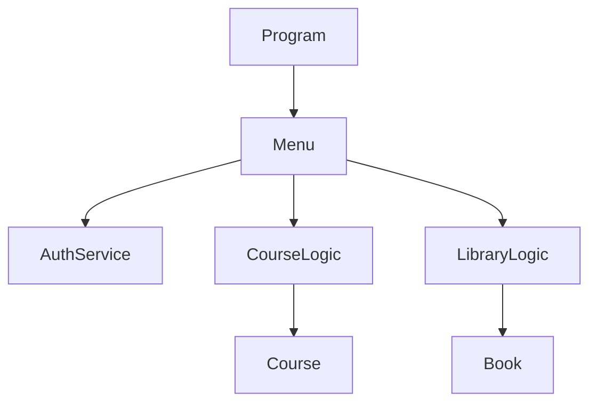
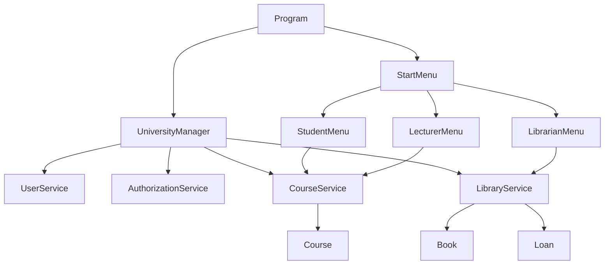
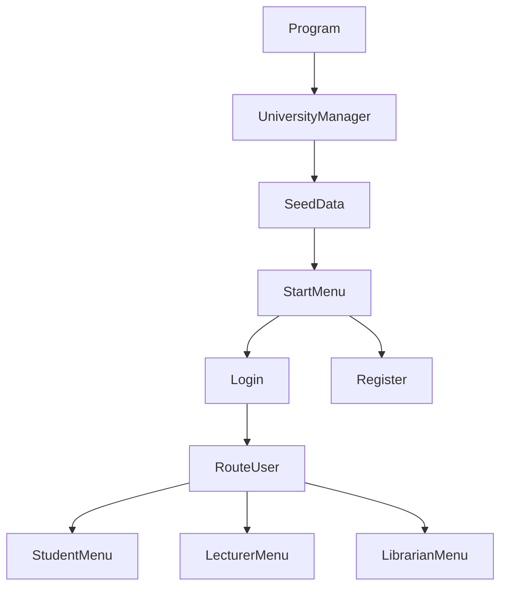
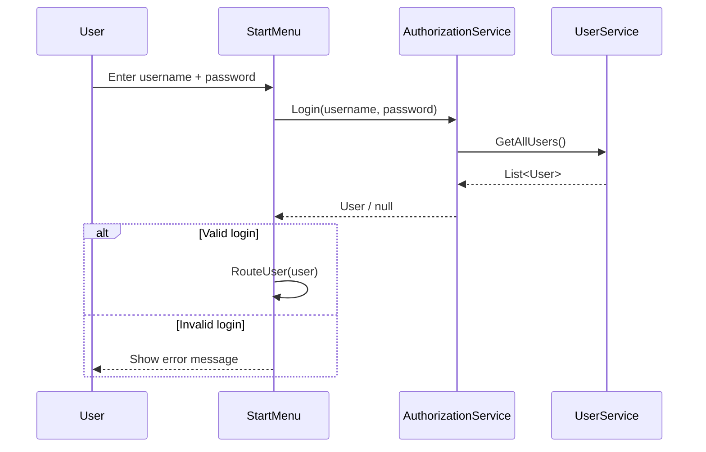
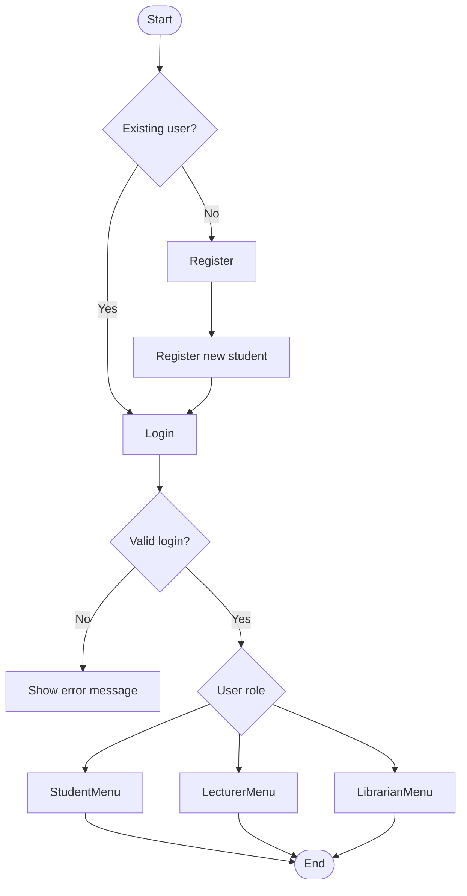

# Uni-system

A simple university administration system built in C# as a learning project.  
The application simulates core university operations such as student enrollment, course management, authentication, and library book loans through a console-based interface.

Developed for course assignment **IS-110** (Winter/Spring 2026).

---

## Project Purpose

This project was created to practice object-oriented programming in C# and understand how different parts of a software system can be organized into separate responsibilities.

The system models:

- Students and exchange students
- Lecturers and librarians
- Courses and enrollment
- Books and loans
- Authentication and role-based access

---

## Refactoring Overview

This project has undergone a structured refactoring process to improve:

- Naming consistency
- Separation of concerns
- Maintainability
- Readability
- Role-based architecture

---

## Before vs After (High-Level)

| Area | Before Refactoring | After Refactoring |
|------|------------------|------------------|
| Authentication | `AuthService` | `AuthorizationService` |
| Menu structure | `Menu.cs` | `StartMenu.cs` + role-based menus |
| Course model | `Code`, `Name`, `MaxCapacity` | `CourseCode`, `CourseName`, `MaxStudents` |
| Architecture | Mixed responsibilities | Clear separation (Models / Services / UI / Data) |
| Startup flow | Unclear | `Program → UniversityManager → SeedData → StartMenu` |
| Validation | Spread across UI and logic | Centralized in services |
| Naming | Inconsistent | Standardized (`UniversitySystem`) |

---

## Architecture (Before)

### Problems:

- Tight coupling
- Logic inside UI
- Weak separation of concerns



---

## Architecture (After)

### Improvements:

- Clear layered architecture
- Separation of concerns (UI vs Services)
- Role-based UI structure
- Centralized business logic in services



---

## Application Flow


--- 

## Login Sequence Diagram


---

## BPMN-like Process (User Flow)


---

## Features

### Authentication
- Login with username/password
- Register new student
- Role-based routing after login
### Student
- View enrolled courses
- Enroll / unenroll from courses
- View grades
- Search books
- Borrow and return books
### Lecturer
- Create courses
- Prevent duplicate course codes/names
- Add syllabus to courses
- Assign grades to students
- Search books
- Borrow and return books
### Librarian
- Register books
- View inventory
- View active loans
- View loan history

---

## Business Rules

### Course Rules
- Only lecturers can create courses
- Course code must be unique
- Course name must be unique
- Course capacity is enforced (no over-enrollment)
- A student cannot enroll in the same course more than once
- Only the course owner (lecturer) can:
  - Add syllabus
  - Assign grades

---

### Library Rules
- Only librarians can register books
- A book can only be borrowed if copies are available
- A user cannot borrow the same book multiple times simultaneously
- A book can only be returned if there is an active loan
- All loans are tracked with:
  - Loan date
  - Return date

---

### User Rules
- Username must be unique
- Email must be unique
- Required fields must be provided (no empty input)
- Login requires valid username and password

---
## Example (Before vs After Code)
// Before
```bash
var course = new Course(code, name, maxCapacity);
```
// After
```bash
var course = new Course(courseCode, courseName, credits, maxStudents, lecturerId);
```
---

## How to Run

### Requirements

- .NET SDK installed  
- Visual Studio or Visual Studio Code  

### Run the project

```bash
dotnet run
```

---
## Seed Data Included

The application starts with preloaded demo data to simplify testing and exploration of features.

The seeded data includes:

- Students
- Exchange students
- Lecturers
- Librarians
- Courses
- Books

This allows you to immediately:

- Log in with demo users
- Test role-based menus
- Interact with courses and library features

---

## 🧪 Unit Testing

The project includes a dedicated test project using **xUnit**.

### Tests implemented:

- **CourseServiceTests**
  - Prevent duplicate enrollment
  - Prevent duplicate course codes

- **LibraryServiceTests**
  - Prevent borrowing when no copies are available
  - Validate successful book return

- **AuthorizationServiceTests**
  - Prevent registration with existing username

Run tests with:

```bash
dotnet test
```
---

## Technologies Used

- C#
- .NET Console Application
- Object-Oriented Programming (OOP)
- xUnit (Unit Testing)

---

## Learning Goals

This project was developed to practice:

- Encapsulation
- Separation of concerns
- Layered architecture (Models / Services / UI)
- List and collection handling
- Method design and responsibility
- Basic validation and business rules
- Refactoring and code standardization
- Role-based system design
- Unit testing of core logic

---

## Current Limitations

This project currently uses in-memory data only.

That means:

- In-memory data only (no database)
- No persistence (data resets on restart)
- Console-based UI

---

## Possible Future Improvements

- Database integration (SQL / Entity Framework)
- Improved input validation (regex, stronger rules)
- More advanced search/filter functionality
- GUI (WPF / Web application)
- Authentication with hashing/security
- Expanded test coverage
- Multi language support
---

## Documentation Notes

This project is intended as a learning project, so the code prioritizes readability over advanced architecture.

---

## Author

**Jaime Montanares** https://github.com/jaimemontanares

---

## Acknowledgment

Parts of the documentation were improved through iterative feedback and AI-assisted writing support, with all final project structure, implementation, and adaptation carried out by the author.

---

## Project Status

Under development.
